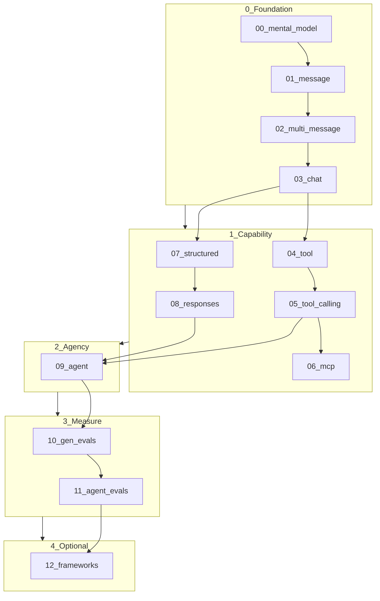

# llm-api-compare — 0→100 LLM harness

Progressive path from one API message to **agents**, **evals**, and an optional **frameworks** lesson.  
Mostly **Python scripts** + [lessons/NOTES.md](lessons/NOTES.md). Core path has no framework.

## Setup

Needs **Python 3.10+** (3.12 recommended; `mcp` does not support 3.9).

```bash
# example with pyenv
~/.pyenv/versions/3.12.13/bin/python -m venv .venv
source .venv/bin/activate
pip install -r requirements.txt
cp .env.example .env   # add OPENROUTER_API_KEY
```

| Env | Purpose | Default |
|---|---|---|
| `OPENROUTER_API_KEY` | required | — |
| `OPENROUTER_MODEL_CHAT` | lessons 00–04, 06–08, 10 | `nvidia/nemotron-3-ultra-550b-a55b:free` |
| `OPENROUTER_MODEL_TOOLS` | lessons **05, 09, 11, 12** (must support `tools`) | `openai/gpt-oss-20b:free` (see `.env.example`) |

Pick a tool-capable model: [openrouter.ai/models?supported_parameters=tools](https://openrouter.ai/models?supported_parameters=tools).

## Curriculum



```text
Foundation     00 mental model → 01 message → 02 multi-message → 03 chat
Capability     04 tool → 05 tool calling → 06 MCP → 07 structured → 08 responses
Agency         09 agent loop
Measure        10 gen evals → 11 agent evals
Optional       12 frameworks (LangChain sugar on the same loop)
```

| # | Lesson | Run |
|---|---|---|
| 00 | Mental model | `python lessons/00_mental_model.py` |
| 01 | Message | `python lessons/01_message.py` |
| 02 | Multi-message | `python lessons/02_multi_message.py` |
| 03 | Chat (+ constrained) | `python lessons/03_chat.py` |
| 04 | Tool (plain Python) | `python lessons/04_tool.py` |
| 05 | Tool calling | `python lessons/05_tool_calling.py` |
| 06 | MCP | `python lessons/06_mcp.py` |
| 07 | Structured data | `python lessons/07_structured.py` |
| 08 | Responses | `python lessons/08_responses.py` |
| 09 | Agent | `python lessons/09_agent.py` |
| 10 | Gen evals | `python lessons/10_gen_evals.py` |
| 11 | Agent evals | `python lessons/11_agent_evals.py` |
| 12 | Frameworks (optional) | `python lessons/12_frameworks.py` |

Concept notes: [lessons/NOTES.md](lessons/NOTES.md).

**Rule of thumb:** call the tool yourself → let the model call it → MCP standardizes access → measure answers, then trajectories → (optional) see the same loop in a framework.

## Layout

```
common.py          # OpenRouter chat helpers
tools.py           # word_stats, calculator
agent.py           # minimal tool loop
mcp_server.py      # stdio MCP server
lessons/           # NN_*.py scripts + NOTES.md
evals/             # gen_cases.jsonl, agent_cases.jsonl
notebooks/         # optional tables only
```

## Optional: Cursor MCP

```json
{
  "mcpServers": {
    "llm-harness-tools": {
      "command": "/ABS/PATH/llm-api-compare/.venv/bin/python",
      "args": ["/ABS/PATH/llm-api-compare/mcp_server.py"]
    }
  }
}
```

## Notes

- Lessons **00–11** are framework-free; **12** shows LangChain as optional sugar on the same loop.
- Free-tier OpenRouter can return `error` with HTTP 200 when capacity is exhausted; wait and retry.
- Older `compare_apis.ipynb` is superseded by lesson 03 (+ optional notebook).
